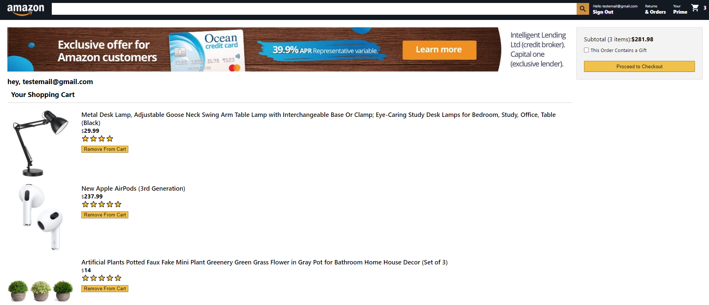

# Full-Stack-Amazon-Clone

This project is an amazon-clone, with a dedicated login page, home screen, checkout page, and payment page. 

Visit the site here: http://haris-sujethan.github.io/Full-Stack-E-commerce-Website

This is the login/register page. Where an existing user can sign in, and a new user can register. The login/register is handled by firebase authentication.

This is the home page. This page allows the user to scroll through any items listed on the page and add them to the cart.

This is the cart page. This page allows the user to view all items in their cart. If a user removes any items, the subtotal will subsequently update.

This is the payment page. Users can revise their personal information (email, address, city, province/state) on this page. Remove from cart functionality is also available on this page.

